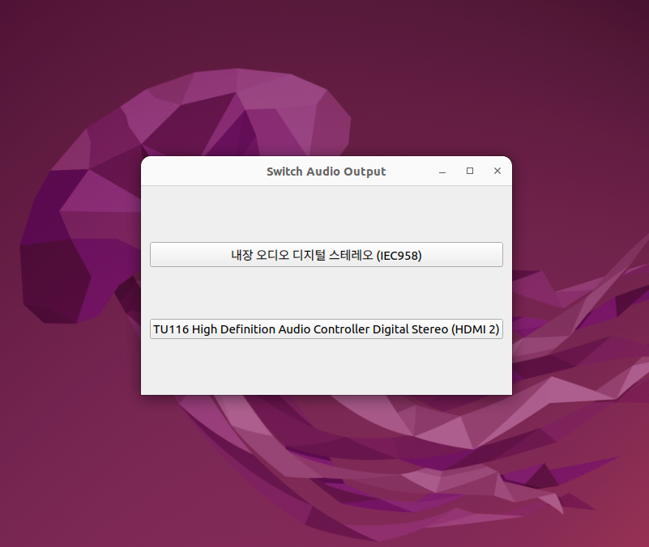

# LAOS (Linux Audio Output Selector)
>**리눅스에서 간편한 단축키로 사운드 출력 장치를 선택하세요!**   
Choose your sound output device with easy shortcuts on Linux!

*윈도우는 ```ctrl+ window + V```로 사운드 장치를 선택할 수 있는데
리눅스는 없어서 만들었음*

<br />
<br />

## LAOS



<br />
<br />


## 사용법
```bash
sudo add-apt-repository ppa:ramge132/audioselect
```
```bash
sudo apt-get update
```
```bash
sudo apt-get install audioselect
```

<br />

이제 리눅스에서도 **```ctrl+ window + V```** 를 입력하여 
사운드 장치를 바로 선택할 수 있습니다!